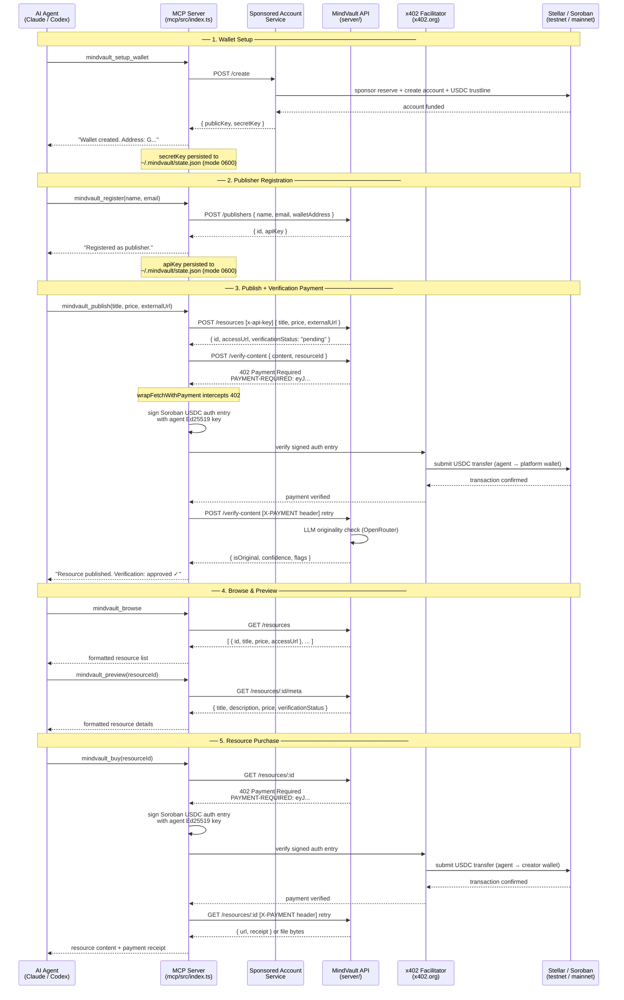

# MCP Architecture — Agent Flow

This document describes how an AI agent (Claude Code, Codex, or any MCP-enabled client) interacts with MindVault through the MCP server.

The MCP server is a thin adapter layer. It translates natural-language tool calls into HTTP API requests and x402 payment flows, then returns a human-readable text block and, for tools with structured results, a machine-readable `structuredContent` object (see [mcp-structured-output.md](mcp-structured-output.md)). The agent never touches Stellar or Soroban directly — the MCP server handles wallet management, payment signing, and x402 negotiation.

---

## Flow Diagram

---

## Call Types

| Arrow                 | Protocol    | Description                             |
| --------------------- | ----------- | --------------------------------------- |
| Agent → MCP           | MCP (stdio) | Tool call via Model Context Protocol    |
| MCP → Sponsored       | HTTPS       | REST: create sponsored Stellar account  |
| MCP → API             | HTTPS       | REST: resource and publisher operations |
| MCP → Facilitator     | HTTPS       | x402: verify payment auth entry         |
| Facilitator → Stellar | Soroban RPC | Submit USDC transaction on-chain        |

---

## Persisted State

The MCP server holds two pieces of state per wallet profile across tool calls:

| State                                    | Set by                   | Used by                                                                             |
| ---------------------------------------- | ------------------------ | ----------------------------------------------------------------------------------- |
| `agentWallet` `{ publicKey, secretKey }` | `mindvault_setup_wallet` | `mindvault_register`, `mindvault_publish`, `mindvault_buy`, `mindvault_wallet_info` |
| `agentApiKey`                            | `mindvault_register`     | `mindvault_publish`                                                                 |

Both are persisted to `~/.mindvault/state.json` (mode `0600`) and reloaded on
restart, so a new session does not have to re-create the wallet or re-register.
Clear them with `mindvault_reset`. Multiple named identities live side by side —
see [wallet profiles](mcp-wallet-profiles.md) — and the file's location,
permissions, and backup path are covered in
[client configs → state path](mcp-client-configs.md#state-path).

---

## Tool Summary

| Tool                         | API Call(s)                                      | Stellar/Soroban                                                        |
| ---------------------------- | ------------------------------------------------ | ---------------------------------------------------------------------- |
| `mindvault_setup_wallet`     | `POST /create` (sponsored service)               | Creates account + trustline                                            |
| `mindvault_wallet_info`      | Horizon `/accounts/:key`                         | Reads USDC balance                                                     |
| `mindvault_browse`           | `GET /resources`                                 | None                                                                   |
| `mindvault_preview`          | `GET /resources/:id/meta`                        | None                                                                   |
| `mindvault_register`         | `POST /publishers`                               | None                                                                   |
| `mindvault_publish`          | `POST /resources`, `POST /verify-content` (x402) | Signs + settles USDC payment to platform wallet                        |
| `mindvault_buy`              | `GET /resources/:id` (x402)                      | Signs + settles USDC payment to creator wallet; persists local receipt |
| `mindvault_purchase_history` | Local `~/.mindvault/purchases.json`              | None (read-only; filter by resourceId / network)                       |
| `mindvault_agent_status`     | `GET /agent/status`                              | None                                                                   |

---

## Environment Variables (MCP Server)

| Variable                | Default                                                | Description                         |
| ----------------------- | ------------------------------------------------------ | ----------------------------------- |
| `MINDVAULT_URL`         | `https://mindvault-hyr3.onrender.com`                  | MindVault API base URL              |
| `SPONSORED_ACCOUNT_URL` | `https://stellar-sponsored-agent-account.onrender.com` | Sponsored account service URL       |
| `HORIZON_URL`           | `https://horizon-testnet.stellar.org`                  | Stellar Horizon for balance queries |

The MCP server has no `.env` file of its own — pass variables via your MCP client config or shell environment. The full list, plus copy-ready client configs and security notes, is in [docs/mcp-client-configs.md](mcp-client-configs.md).
